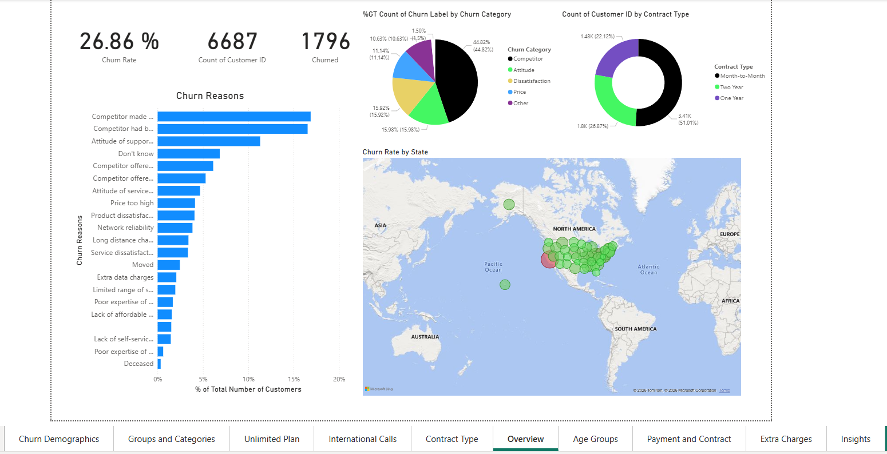
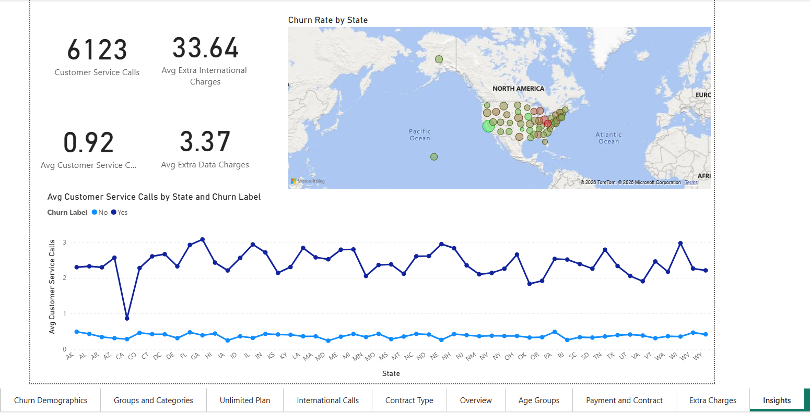

# 📊 Customer Churn Analysis Dashboard (Power BI)

---

## 📌 Overview
This project presents an interactive Power BI dashboard designed to analyze customer churn behavior. It focuses on identifying patterns and key factors contributing to customer churn and improving retention strategies.

---

## 🎯 Objectives
- Analyze customer churn rate  
- Identify key drivers of churn  
- Provide actionable business insights  
- Improve customer retention strategies  

---

## 🛠 Tools & Technologies
- Power BI  
- DAX (Data Analysis Expressions)  
- Power Query (Data Cleaning)  

---

## 📷 Dashboard Preview

### 🔹 Overview Dashboard

### 🔹 Churn Demographics

### 🔹 Customer Segmentation

### 🔹 Key Insights Dashboard

---

## 📊 Dashboard Features
- KPI cards showing total customers, churned customers, and churn rate  
- Churn analysis by contract type, payment method, and demographics  
- Customer behavior analysis (service calls, usage patterns)  
- Churn reason analysis  
- Interactive filters and slicers  

---

## 💡 Key Insights
- Customers with **month-to-month contracts** have the highest churn rate  
- Senior customers exhibit higher churn rates compared to other age groups  
- High **customer service calls** indicate dissatisfaction and increase churn  
- **Competitor pricing and offers** are the primary reasons for churn  
- Customers with **low data usage and no unlimited plan** tend to churn more  
- Long-term contracts significantly reduce churn  

---

## 🚀 Business Recommendations
- Encourage long-term contracts with discounts  
- Improve customer support experience  
- Offer competitive pricing plans  
- Target high-risk customers with retention strategies  

---

## 📌 Conclusion
This dashboard enables businesses to understand customer behavior, reduce churn, improve retention, and enhance overall customer experience.
